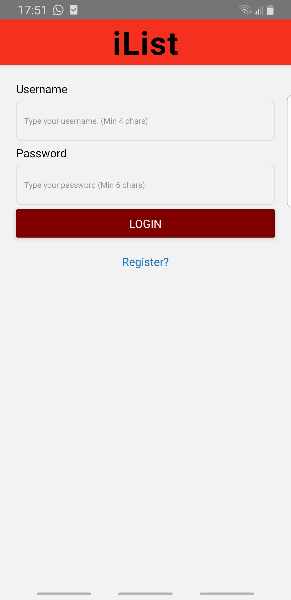
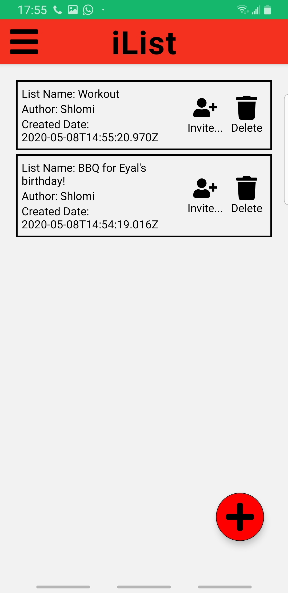
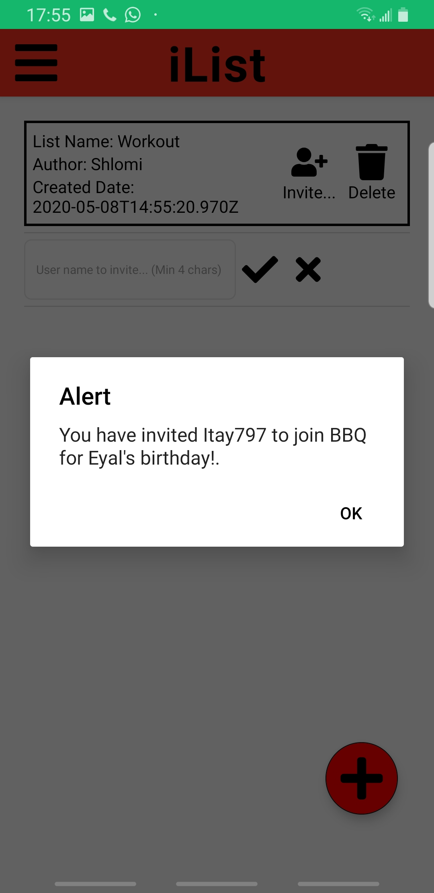
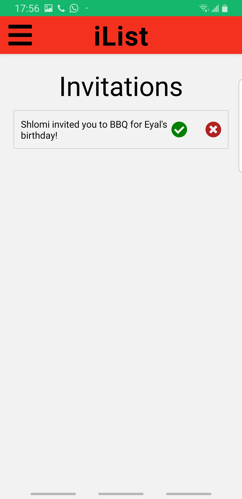
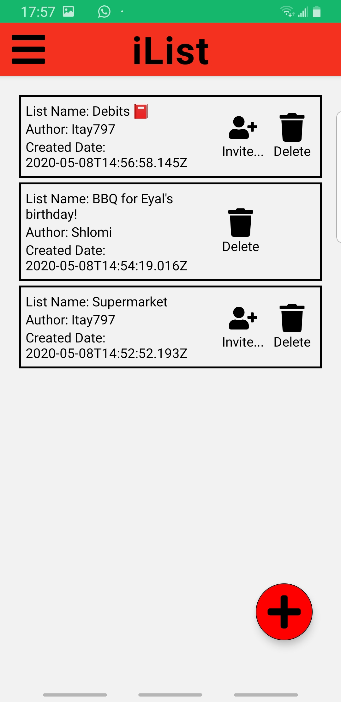
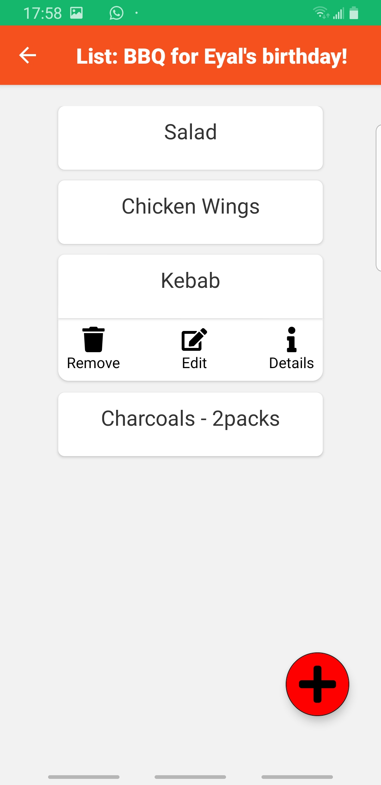
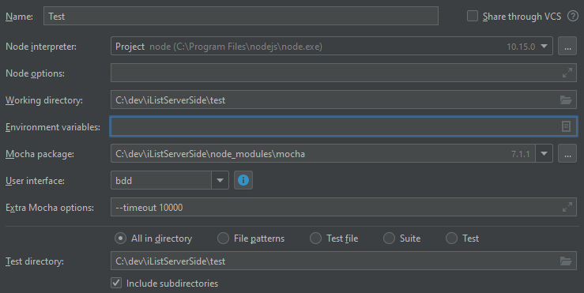
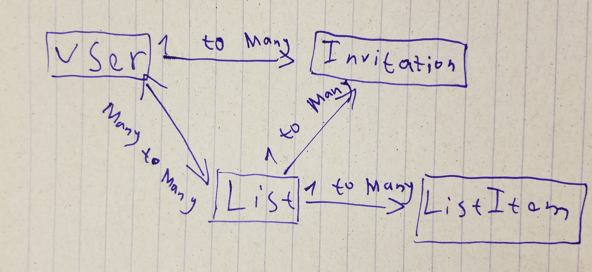

# iList - Server-Side

Shared lists for everyone.

# Link for the Code Review
https://github.com/Taytay884/iListServerSideCodeReview/pull/1/files#

## Just to illustrate the project.

So we have started the project with React-Native which is really not familiar for us. 
The code there looks terrible and I don't want you guys to ravel with it.

#### Some pictures for illustration.

These instructions will get you a copy of the project up and running on your local machine for development and testing purposes.
See deployment for notes on how to deploy the project on a live system.

#### Login


#### Lists of Shlomi


#### Invite Itay797 to Shlomi's List


#### Invitations


#### Lists of Itay797


#### Inside the shared list


### Running the tests
First `npm i` and after that `npm run test`.
I'm using MongoDB Atlas server to run the tests on So run the tests one-by-one =]

The test files are separated by models. (List, List-Item, User and Invitation)

##### Configuration for Debug on WebStorm


## Explanation of the code

## STACK
* Server: Node.JS (Express).
* Database: MongoDB (Mongoose).
* Authentication: Express-Session.
* Push-Notifications: OneSignal.

## Story
The code begins on `server.js`
Loading sessions, mongo and routes.
I'm using a pretty comfy convention to implement.

```Routes -> Logic -> DAL (Data Access Layer)```

#### Routes
Routes- Responsible to get and validate the requests from the client and pass them to the Logic.
Once Routes will get a response from logic he is responsible to send it to the client.

There are "Routes"s file for every model and middlewares.
Routes have two middlewares, one for **authentication** and one for **validation** (Joi).
The Routes is talking directly with the Logic.

#### Logic
Logic- Responsible to implement the whole business logic inside using the **DAL** and send a proper response to Routes.
There are "Logic"s file for every model.

#### DAL - Data Access Layer
DAL is responsible to access the database and to serve **Logic**. 

#### Error handling
On every part, routes, logic or dal we are listening to an error. If there's an error we will send it to the client.
I have extended Error and used RequestError to show the client if he sent broken requests.
If there's a server problem we will respond with "Something went wrong." because I don't want the user to find vulnerabilities on my code.

STATUS CODES: Validation Error 422, Not authenticated: 403, Request Error: 400, Server Error: 500.

## Models

#### Diagram
There are 4 models: List, ListItem, User and Invitation.



#### List
Every list has many: 
1) List items.
2) Invitations.
3) Users (participants).

##### Functionality:
The owner of the list can:
* Delete the entire list.
* Invite other users to his list to became collaborators.

Every collaborator can:
* Remove this list. (Stop being a collaborate)

#### List Item
Every list has many list items.

##### Functionality:
Collaborator and Owner can CRUD:
* Edit list items.
* Add list items.
* Delete list items.
* Read list items' details.

#### Invitation
Invitation is a list invitation.
Invitation has:
* A recipient.
* A sender.
* A referenced list.

##### Functionality:
* We can send list invitations.
* Accept / Decline them.

#### User
Every user has many:
* Invitations.
* Lists.

##### Functionality:
* Everyone can register and became a users.
* A user can login.
* A user can logout.
* ... The functionality I have written on the rest of the models.

## Some comments
The main purpose of this repository is to learn and study.

Please feel free to use it, ask me questions and review my work.
Oh and tell me if this documentation is not enough.
